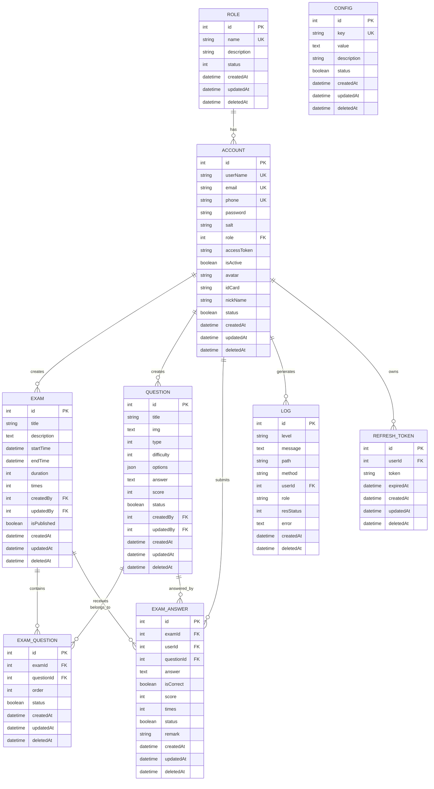
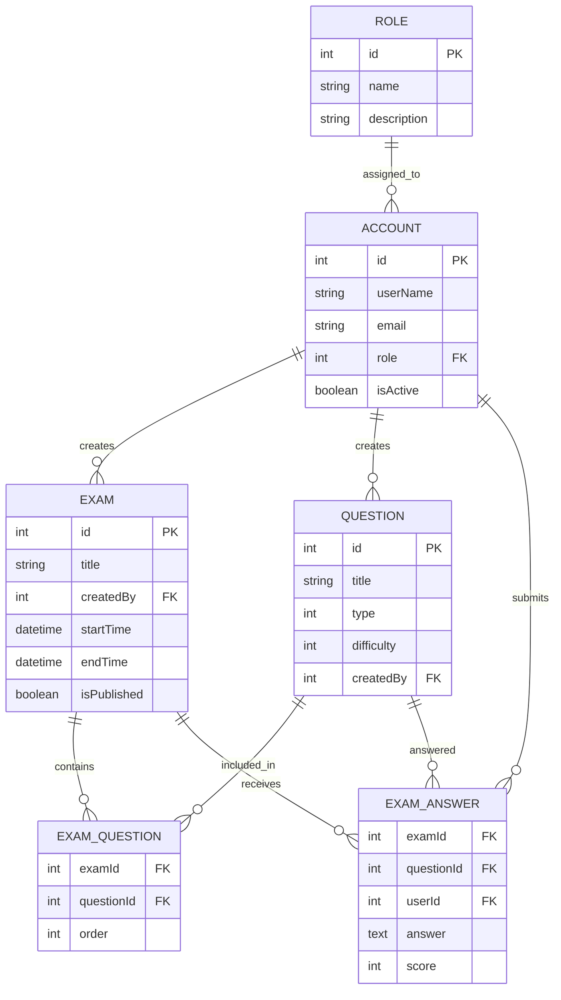
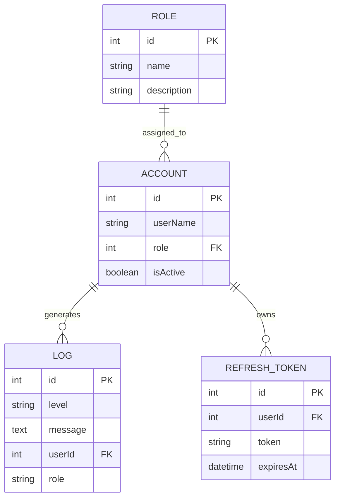
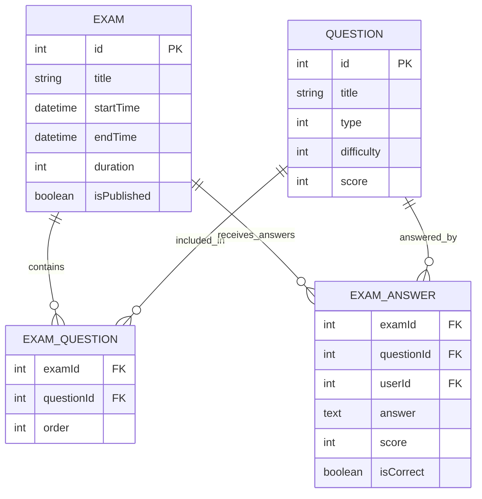
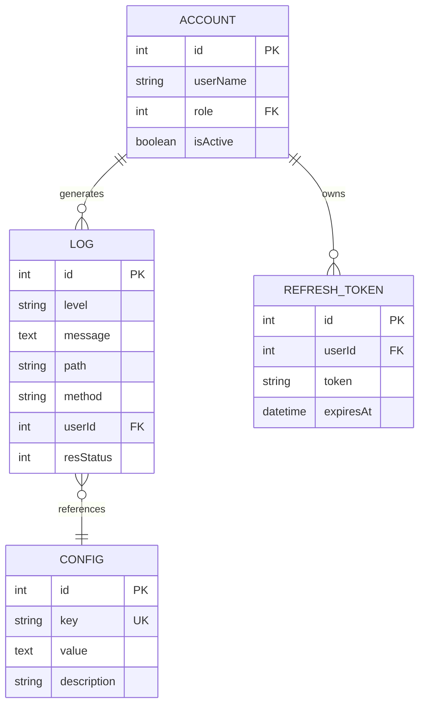

# 在线考试系统数据库ER图

> **注意**: 本文档包含Mermaid图表，请使用支持Mermaid的Markdown预览器查看图表效果。推荐使用VS Code的"Markdown Preview Mermaid Support"插件。

## 图表生成说明
- 使用VS Code打开此文件
- 安装"Markdown Preview Mermaid Support"插件
- 使用`Ctrl+Shift+V`(Windows/Linux)或`Cmd+Shift+V`(Mac)打开预览
- 所有Mermaid图表将自动渲染为可视化图片

## 1. 完整ER图



## 2. 核心实体关系图



## 3. 用户权限关系图



## 4. 考试流程关系图



## 5. 系统管理关系图



## 6. 数据字典

### 6.1 用户账户表 (ACCOUNT)
| 字段名 | 数据类型 | 长度 | 是否为空 | 默认值 | 说明 |
|--------|----------|------|----------|--------|------|
| id | int | - | NOT NULL | AUTO_INCREMENT | 主键 |
| userName | varchar | 255 | NOT NULL | - | 用户名，唯一 |
| email | varchar | 255 | NULL | - | 邮箱，唯一 |
| phone | varchar | 255 | NULL | - | 手机号，唯一 |
| password | varchar | 255 | NOT NULL | - | 密码哈希 |
| salt | varchar | 255 | NOT NULL | - | 密码盐值 |
| role | int | - | NULL | - | 角色ID，外键 |
| accessToken | varchar | 255 | NULL | - | 访问令牌 |
| isActive | boolean | - | NOT NULL | true | 是否激活 |
| avatar | varchar | 255 | NULL | - | 头像URL |
| idCard | varchar | 255 | NULL | - | 身份证号 |
| nickName | varchar | 255 | NULL | - | 昵称 |
| status | boolean | - | NOT NULL | true | 状态 |
| createdAt | datetime | - | NOT NULL | CURRENT_TIMESTAMP | 创建时间 |
| updatedAt | datetime | - | NOT NULL | CURRENT_TIMESTAMP | 更新时间 |
| deletedAt | datetime | - | NULL | - | 删除时间 |

### 6.2 角色表 (ROLE)
| 字段名 | 数据类型 | 长度 | 是否为空 | 默认值 | 说明 |
|--------|----------|------|----------|--------|------|
| id | int | - | NOT NULL | AUTO_INCREMENT | 主键 |
| name | varchar | 255 | NOT NULL | - | 角色名称，唯一 |
| description | text | - | NOT NULL | - | 角色描述 |
| status | int | - | NOT NULL | 1 | 状态 |
| createdAt | datetime | - | NOT NULL | CURRENT_TIMESTAMP | 创建时间 |
| updatedAt | datetime | - | NOT NULL | CURRENT_TIMESTAMP | 更新时间 |
| deletedAt | datetime | - | NULL | - | 删除时间 |

### 6.3 考试表 (EXAM)
| 字段名 | 数据类型 | 长度 | 是否为空 | 默认值 | 说明 |
|--------|----------|------|----------|--------|------|
| id | int | - | NOT NULL | AUTO_INCREMENT | 主键 |
| title | varchar | 255 | NOT NULL | - | 考试标题 |
| description | text | - | NULL | - | 考试描述 |
| startTime | datetime | - | NOT NULL | - | 开始时间 |
| endTime | datetime | - | NOT NULL | - | 结束时间 |
| duration | int | - | NOT NULL | - | 考试时长(分钟) |
| times | int | - | NOT NULL | 1 | 考试次数 |
| createdBy | int | - | NOT NULL | - | 创建者ID |
| updatedBy | int | - | NULL | - | 更新者ID |
| isPublished | boolean | - | NOT NULL | false | 是否发布 |
| createdAt | datetime | - | NOT NULL | CURRENT_TIMESTAMP | 创建时间 |
| updatedAt | datetime | - | NOT NULL | CURRENT_TIMESTAMP | 更新时间 |
| deletedAt | datetime | - | NULL | - | 删除时间 |

### 6.4 题目表 (QUESTION)
| 字段名 | 数据类型 | 长度 | 是否为空 | 默认值 | 说明 |
|--------|----------|------|----------|--------|------|
| id | int | - | NOT NULL | AUTO_INCREMENT | 主键 |
| title | varchar | 255 | NOT NULL | - | 题目标题 |
| img | text | - | NULL | - | 题目图片 |
| type | int | - | NOT NULL | - | 题型(0单选/1多选/2判断/3填空/4简答) |
| difficulty | int | - | NOT NULL | 0 | 难度(0简单/1中等/2困难) |
| options | json | - | NULL | - | 选项(JSON格式) |
| answer | text | - | NULL | - | 标准答案 |
| score | int | - | NOT NULL | - | 题目分数 |
| status | boolean | - | NOT NULL | true | 状态 |
| createdBy | int | - | NOT NULL | - | 创建者ID |
| updatedBy | int | - | NULL | - | 更新者ID |
| createdAt | datetime | - | NOT NULL | CURRENT_TIMESTAMP | 创建时间 |
| updatedAt | datetime | - | NOT NULL | CURRENT_TIMESTAMP | 更新时间 |
| deletedAt | datetime | - | NULL | - | 删除时间 |

### 6.5 考试题目关联表 (EXAM_QUESTION)
| 字段名 | 数据类型 | 长度 | 是否为空 | 默认值 | 说明 |
|--------|----------|------|----------|--------|------|
| id | int | - | NOT NULL | AUTO_INCREMENT | 主键 |
| examId | int | - | NOT NULL | - | 考试ID，外键 |
| questionId | int | - | NOT NULL | - | 题目ID，外键 |
| order | int | - | NOT NULL | 0 | 题目顺序 |
| status | boolean | - | NOT NULL | true | 状态 |
| createdAt | datetime | - | NOT NULL | CURRENT_TIMESTAMP | 创建时间 |
| updatedAt | datetime | - | NOT NULL | CURRENT_TIMESTAMP | 更新时间 |
| deletedAt | datetime | - | NULL | - | 删除时间 |

### 6.6 考试答案表 (EXAM_ANSWER)
| 字段名 | 数据类型 | 长度 | 是否为空 | 默认值 | 说明 |
|--------|----------|------|----------|--------|------|
| id | int | - | NOT NULL | AUTO_INCREMENT | 主键 |
| examId | int | - | NOT NULL | - | 考试ID，外键 |
| userId | int | - | NOT NULL | - | 用户ID，外键 |
| questionId | int | - | NOT NULL | - | 题目ID，外键 |
| answer | text | - | NULL | - | 用户答案 |
| isCorrect | boolean | - | NULL | - | 是否正确 |
| score | int | - | NULL | - | 得分 |
| times | int | - | NULL | - | 作答次数 |
| status | boolean | - | NOT NULL | true | 状态 |
| remark | varchar | 255 | NULL | - | 评价 |
| createdAt | datetime | - | NOT NULL | CURRENT_TIMESTAMP | 创建时间 |
| updatedAt | datetime | - | NOT NULL | CURRENT_TIMESTAMP | 更新时间 |
| deletedAt | datetime | - | NULL | - | 删除时间 |

### 6.7 系统配置表 (CONFIG)
| 字段名 | 数据类型 | 长度 | 是否为空 | 默认值 | 说明 |
|--------|----------|------|----------|--------|------|
| id | int | - | NOT NULL | AUTO_INCREMENT | 主键 |
| key | varchar | 100 | NOT NULL | - | 配置键，唯一 |
| value | text | - | NULL | - | 配置值 |
| description | varchar | 255 | NULL | - | 配置描述 |
| status | boolean | - | NOT NULL | true | 状态 |
| createdAt | datetime | - | NOT NULL | CURRENT_TIMESTAMP | 创建时间 |
| updatedAt | datetime | - | NOT NULL | CURRENT_TIMESTAMP | 更新时间 |
| deletedAt | datetime | - | NULL | - | 删除时间 |

### 6.8 系统日志表 (LOG)
| 字段名 | 数据类型 | 长度 | 是否为空 | 默认值 | 说明 |
|--------|----------|------|----------|--------|------|
| id | int | - | NOT NULL | AUTO_INCREMENT | 主键 |
| level | varchar | 50 | NOT NULL | - | 日志级别(info/warn/error) |
| message | text | - | NOT NULL | - | 日志内容 |
| path | varchar | 255 | NULL | - | 请求路径或操作模块 |
| method | varchar | 255 | NULL | - | 请求方法 |
| userId | int | - | NULL | - | 用户ID，外键 |
| role | varchar | 255 | NULL | - | 角色 |
| resStatus | int | - | NULL | - | 返回状态 |
| error | text | - | NULL | - | 错误信息 |
| createdAt | datetime | - | NOT NULL | CURRENT_TIMESTAMP | 记录时间 |
| deletedAt | datetime | - | NULL | - | 删除时间 |

### 6.9 刷新令牌表 (REFRESH_TOKEN)
| 字段名 | 数据类型 | 长度 | 是否为空 | 默认值 | 说明 |
|--------|----------|------|----------|--------|------|
| id | int | - | NOT NULL | AUTO_INCREMENT | 主键 |
| userId | int | - | NOT NULL | - | 用户ID，外键 |
| token | varchar | 255 | NOT NULL | - | 刷新令牌 |
| expiredAt | datetime | - | NOT NULL | - | 过期时间 |
| createdAt | datetime | - | NOT NULL | CURRENT_TIMESTAMP | 创建时间 |
| updatedAt | datetime | - | NOT NULL | CURRENT_TIMESTAMP | 更新时间 |
| deletedAt | datetime | - | NULL | - | 删除时间 |

## 7. 索引设计

### 7.1 主要索引
```sql
-- 用户账户表索引
CREATE UNIQUE INDEX idx_account_user_name ON account(user_name);
CREATE UNIQUE INDEX idx_account_email ON account(email);
CREATE UNIQUE INDEX idx_account_phone ON account(phone);
CREATE INDEX idx_account_role ON account(role);
CREATE INDEX idx_account_status ON account(status);

-- 考试表索引
CREATE INDEX idx_exam_created_by ON exam(created_by);
CREATE INDEX idx_exam_start_time ON exam(start_time);
CREATE INDEX idx_exam_end_time ON exam(end_time);
CREATE INDEX idx_exam_is_published ON exam(is_published);
CREATE INDEX idx_exam_creator_published ON exam(created_by, is_published);

-- 题目表索引
CREATE INDEX idx_question_type ON question(type);
CREATE INDEX idx_question_difficulty ON question(difficulty);
CREATE INDEX idx_question_created_by ON question(created_by);
CREATE INDEX idx_question_status ON question(status);
CREATE INDEX idx_question_type_difficulty ON question(type, difficulty);

-- 考试答案表索引
CREATE INDEX idx_exam_answer_exam_id ON exam_answer(exam_id);
CREATE INDEX idx_exam_answer_user_id ON exam_answer(user_id);
CREATE INDEX idx_exam_answer_question_id ON exam_answer(question_id);
CREATE INDEX idx_exam_answer_exam_user ON exam_answer(exam_id, user_id);
CREATE INDEX idx_exam_answer_exam_question ON exam_answer(exam_id, question_id);
```

### 7.2 复合索引
```sql
-- 考试题目关联表复合索引
CREATE INDEX idx_exam_question_exam_order ON exam_question(exam_id, order);
CREATE INDEX idx_exam_question_question ON exam_question(question_id);

-- 日志表索引
CREATE INDEX idx_log_user_id ON log(user_id);
CREATE INDEX idx_log_level ON log(level);
CREATE INDEX idx_log_created_at ON log(created_at);
CREATE INDEX idx_log_path_method ON log(path, method);
CREATE INDEX idx_log_role ON log(role);
CREATE INDEX idx_log_res_status ON log(res_status);
CREATE INDEX idx_log_user_level ON log(user_id, level);
CREATE INDEX idx_log_created_level ON log(created_at, level);

-- 刷新令牌表索引
CREATE INDEX idx_refresh_token_user_id ON refresh_token(user_id);
CREATE INDEX idx_refresh_token_expires_at ON refresh_token(expires_at);
CREATE INDEX idx_refresh_token_token ON refresh_token(token);
```

## 8. 业务关系说明

### 8.1 用户管理关系
- **角色与用户账户**: 一对多关系，一个角色可以有多个用户账户，一个用户账户属于一个角色
- **用户账户与考试**: 一对多关系，一个用户账户可以创建多个考试，一个考试属于一个用户账户
- **用户账户与题目**: 一对多关系，一个用户账户可以创建多个题目，一个题目属于一个用户账户

### 8.2 考试管理关系
- **考试与题目**: 多对多关系，通过考试题目关联表实现，一个考试可以包含多个题目，一个题目可以属于多个考试
- **考试与考试答案**: 一对多关系，一个考试可以接收多个考试答案，一个考试答案属于一个考试
- **题目与考试答案**: 一对多关系，一个题目可以有多个考试答案，一个考试答案对应一个题目

### 8.3 系统管理关系
- **用户账户与系统日志**: 一对多关系，一个用户账户可以生成多个系统日志，一个系统日志属于一个用户账户
- **用户账户与刷新令牌**: 一对多关系，一个用户账户可以有多个刷新令牌，一个刷新令牌属于一个用户账户

### 8.4 系统功能说明
- **用户管理**: 支持用户的注册、登录、角色分配、状态管理
- **考试管理**: 支持考试的创建、发布、时间控制、状态管理
- **题目管理**: 支持题目的创建、分类、难度设置、状态管理
- **答题系统**: 支持学生答题、答案保存、自动评分、成绩统计
- **权限管理**: 支持基于角色的权限控制和访问控制
- **日志管理**: 支持系统操作日志记录和审计追踪

## 9. 图表导出说明

### 9.1 使用VS Code导出图片
1. 安装"Markdown Preview Mermaid Support"插件
2. 打开此文件，使用预览功能
3. 右键点击Mermaid图表，选择"Save as Image"
4. 选择保存格式(PNG/SVG)和保存位置

### 9.2 使用在线工具
1. 复制Mermaid代码到 [Mermaid Live Editor](https://mermaid.live/)
2. 在线编辑和预览图表
3. 导出为PNG/SVG格式

### 9.3 使用命令行工具
```bash
# 安装mermaid-cli
npm install -g @mermaid-js/mermaid-cli

# 生成PNG图片
mmdc -i er_diagram.mmd -o er_diagram.png

# 生成SVG图片
mmdc -i er_diagram.mmd -o er_diagram.svg
```