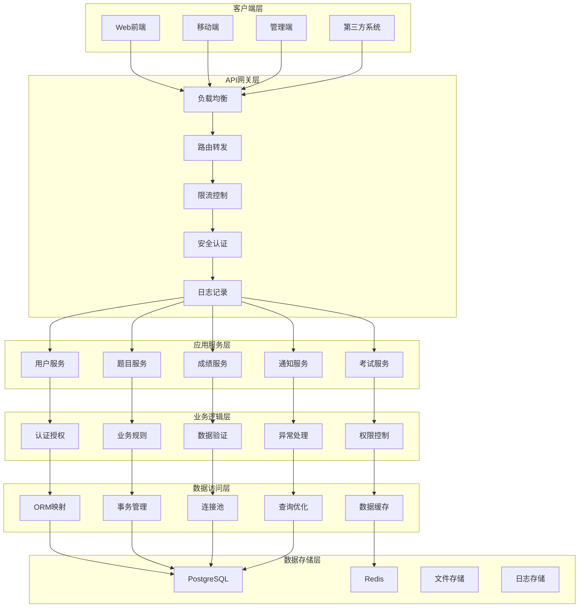
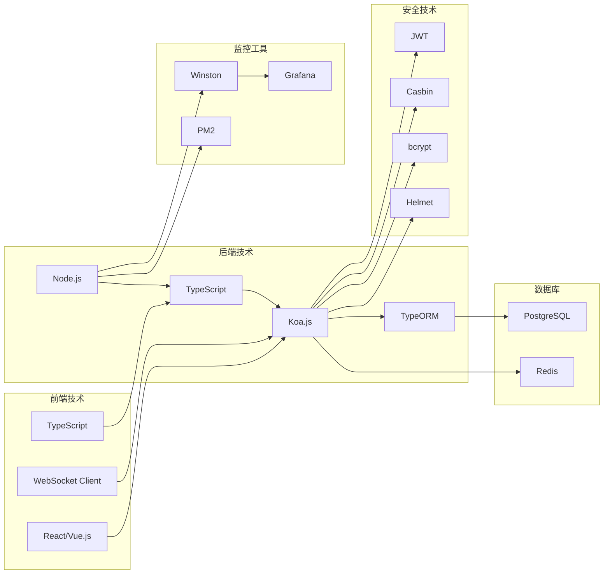
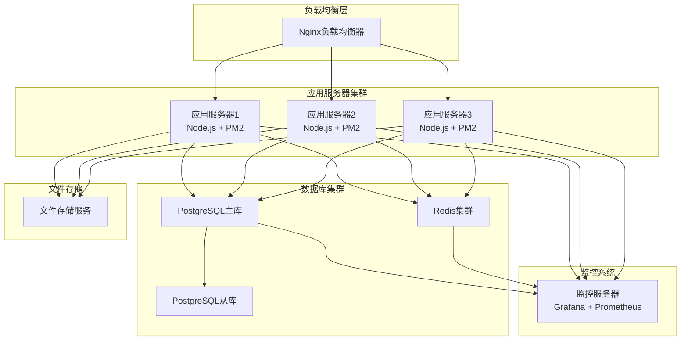
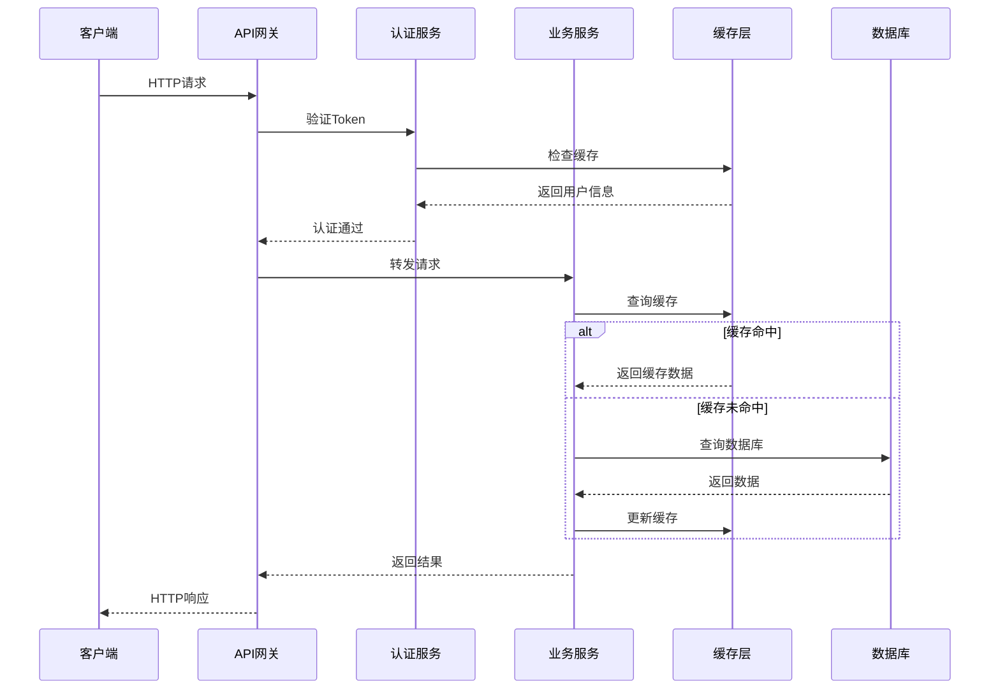
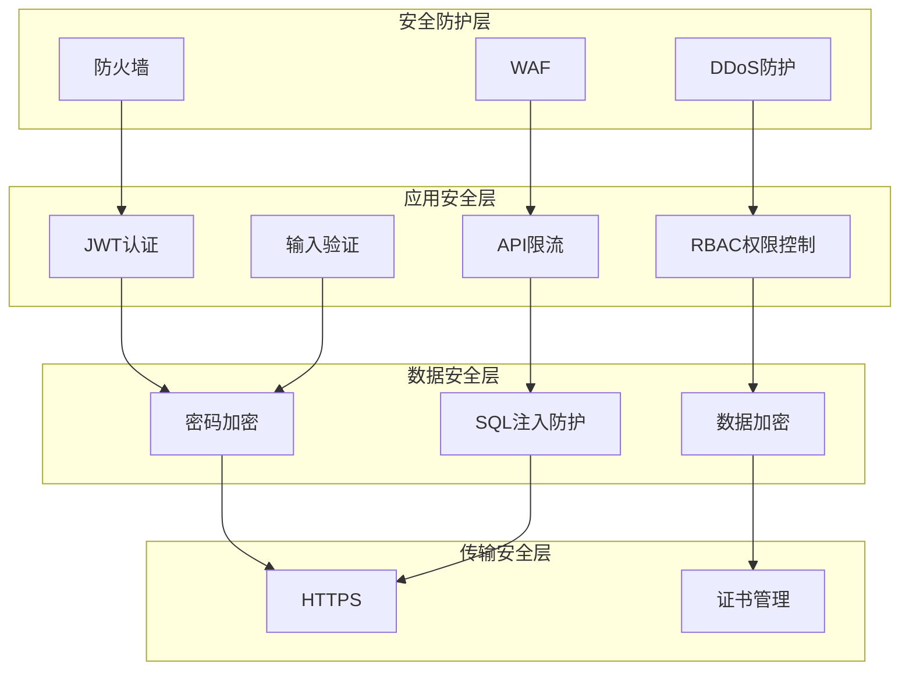
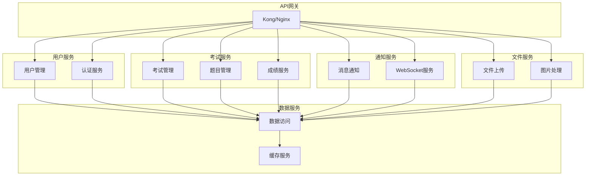

# 系统架构设计图

## 1. 总体架构图

```mermaid
graph TB
    subgraph "客户端层"
        A[Web前端] 
        B[移动端]
        C[管理端]
        D[第三方系统]
    end
    
    subgraph "API网关层"
        E[负载均衡]
        F[路由转发]
        G[限流控制]
        H[安全认证]
        I[日志记录]
    end
    
    subgraph "应用服务层"
        J[用户服务]
        K[考试服务]
        L[题目服务]
        M[成绩服务]
        N[通知服务]
    end
    
    subgraph "业务逻辑层"
        O[认证授权]
        P[权限控制]
        Q[业务规则]
        R[数据验证]
        S[异常处理]
    end
    
    subgraph "数据访问层"
        T[ORM映射]
        U[数据缓存]
        V[事务管理]
        W[连接池]
        X[查询优化]
    end
    
    subgraph "数据存储层"
        Y[PostgreSQL]
        Z[Redis]
        AA[文件存储]
        BB[日志存储]
    end
    
    A --> E
    B --> E
    C --> E
    D --> E
    
    E --> F
    F --> G
    G --> H
    H --> I
    
    I --> J
    I --> K
    I --> L
    I --> M
    I --> N
    
    J --> O
    K --> P
    L --> Q
    M --> R
    N --> S
    
    O --> T
    P --> U
    Q --> V
    R --> W
    S --> X
    
    T --> Y
    U --> Z
    V --> Y
    W --> Y
    X --> Y
```

## 2. 技术架构图

```mermaid
graph LR
    subgraph "前端技术"
        A1[React/Vue.js]
        A2[TypeScript]
        A3[WebSocket Client]
    end
    
    subgraph "后端技术"
        B1[Node.js]
        B2[TypeScript]
        B3[Koa.js]
        B4[TypeORM]
    end
    
    subgraph "数据库"
        C1[PostgreSQL]
        C2[Redis]
    end
    
    subgraph "安全技术"
        D1[JWT]
        D2[Casbin]
        D3[bcrypt]
        D4[Helmet]
    end
    
    subgraph "监控工具"
        E1[Winston]
        E2[PM2]
        E3[Grafana]
    end
    
    A1 --> B3
    A2 --> B2
    A3 --> B3
    
    B1 --> B2
    B2 --> B3
    B3 --> B4
    
    B4 --> C1
    B3 --> C2
    
    B3 --> D1
    B3 --> D2
    B3 --> D3
    B3 --> D4
    
    B1 --> E1
    B1 --> E2
    E1 --> E3
```

## 3. 系统部署架构图

```mermaid
graph TB
    subgraph "负载均衡层"
        LB[Nginx负载均衡器]
    end
    
    subgraph "应用服务器集群"
        APP1[应用服务器1<br/>Node.js + PM2]
        APP2[应用服务器2<br/>Node.js + PM2]
        APP3[应用服务器3<br/>Node.js + PM2]
    end
    
    subgraph "数据库集群"
        DB1[PostgreSQL主库]
        DB2[PostgreSQL从库]
        REDIS[Redis集群]
    end
    
    subgraph "文件存储"
        FS[文件存储服务]
    end
    
    subgraph "监控系统"
        MON[监控服务器<br/>Grafana + Prometheus]
    end
    
    LB --> APP1
    LB --> APP2
    LB --> APP3
    
    APP1 --> DB1
    APP2 --> DB1
    APP3 --> DB1
    
    DB1 --> DB2
    
    APP1 --> REDIS
    APP2 --> REDIS
    APP3 --> REDIS
    
    APP1 --> FS
    APP2 --> FS
    APP3 --> FS
    
    APP1 --> MON
    APP2 --> MON
    APP3 --> MON
    DB1 --> MON
    REDIS --> MON
```

## 4. 数据流架构图

```mermaid
sequenceDiagram
    participant Client as 客户端
    participant Gateway as API网关
    participant Auth as 认证服务
    participant Business as 业务服务
    participant Cache as 缓存层
    participant DB as 数据库
    
    Client->>Gateway: HTTP请求
    Gateway->>Auth: 验证Token
    Auth->>Cache: 检查缓存
    Cache-->>Auth: 返回用户信息
    Auth-->>Gateway: 认证通过
    
    Gateway->>Business: 转发请求
    Business->>Cache: 查询缓存
    alt 缓存命中
        Cache-->>Business: 返回缓存数据
    else 缓存未命中
        Business->>DB: 查询数据库
        DB-->>Business: 返回数据
        Business->>Cache: 更新缓存
    end
    
    Business-->>Gateway: 返回结果
    Gateway-->>Client: HTTP响应
```

## 5. 安全架构图

```mermaid
graph TB
    subgraph "安全防护层"
        A[防火墙]
        B[DDoS防护]
        C[WAF]
    end
    
    subgraph "应用安全层"
        D[JWT认证]
        E[RBAC权限控制]
        F[API限流]
        G[输入验证]
    end
    
    subgraph "数据安全层"
        H[密码加密]
        I[数据加密]
        J[SQL注入防护]
    end
    
    subgraph "传输安全层"
        K[HTTPS]
        L[证书管理]
    end
    
    A --> D
    B --> E
    C --> F
    
    D --> H
    E --> I
    F --> J
    G --> H
    
    H --> K
    I --> L
    J --> K
```

## 6. 微服务架构图

```mermaid
graph TB
    subgraph "API网关"
        GW[Kong/Nginx]
    end
    
    subgraph "用户服务"
        US[用户管理]
        AS[认证服务]
    end
    
    subgraph "考试服务"
        ES[考试管理]
        QS[题目管理]
        SS[成绩服务]
    end
    
    subgraph "通知服务"
        NS[消息通知]
        WS[WebSocket服务]
    end
    
    subgraph "文件服务"
        FS[文件上传]
        IS[图片处理]
    end
    
    subgraph "数据服务"
        DS[数据访问]
        CS[缓存服务]
    end
    
    GW --> US
    GW --> AS
    GW --> ES
    GW --> QS
    GW --> SS
    GW --> NS
    GW --> WS
    GW --> FS
    GW --> IS
    
    US --> DS
    AS --> DS
    ES --> DS
    QS --> DS
    SS --> DS
    NS --> DS
    WS --> DS
    FS --> DS
    IS --> DS
    
    DS --> CS
```

